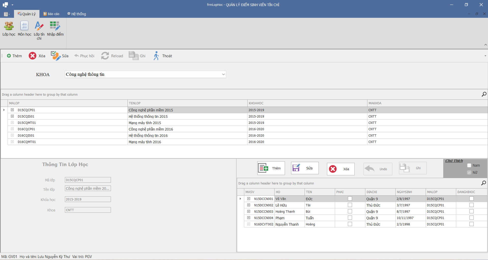

<h1 align="center"> Cơ Sở Dữ Liệu Phân Tán <br/>
 Đề tài:  Quản lý điểm sinh viên hệ tín chỉ  - Thầy Lưu Nguyễn Kỳ Thư
<h1>

   <p align="center"> 
      
   </p>

## Mục Lục

- [Mô tả](#mô-tả)
- [Thành viên tham gia dự án](#thành-viên-tham-gia-dự-án)
- [Bắt đầu](#bắt-đầu)
  - [Yêu cầu](#yêu-cầu)
  - [Cài đặt và Chạy Dự Án](#cài-đặt-và-chạy-dự-án)
- [Nội dung cần tìm hiểu](#noi-dung-can-tim-hieu)
  - [Publication and Subcription](#publication-and-subcription)
  - [Link Server](#link-server)
  - [Stored Procedure](#stored-procedure)
  - [Data Set](#data-set)
- [Tính năng](#tính-năng)
  - [Nhập Liệu](#nhập-liệu)
  - [Phân Quyền](#phân-quyền)
  - [In Ấn](#in-ấn)
- [Cấu trúc Thư mục](#cấu-trúc-thư-mục)
- [Đóng góp](#đóng-góp)
- [Giấy phép](#giấy-phép)
- [Liên hệ](#liên-hệ)

## [**Mô tả**](#mô-tả)

Dự án quản lý điểm sinh viên hệ tín chỉ được phát triển bằng C# và DevExpress là một đồ án nhóm môn học của thầy Lưu Nguyễn Kỳ Thư trong môn học Cơ Sở Dữ Liệu Phân Tán. Ứng dụng giúp quản lý thông tin sinh viên và điểm số của họ trong các môn học, tạo điều kiện thuận lợi cho việc theo dõi và báo cáo kết quả học tập.

## [**Thành viên tham gia dự án**] (#thành-viên-tham-gia-dự-án)

- **Nguyễn Lưu Kỳ Thư** - Giảng viên

  - Vai trò: Hướng dẫn dự án, giảng dạy môn Cơ Sở Dữ Liệu Phân Tán
  - Thông tin liên hệ: [email@example.com](mailto:email@example.com)

- **Nguyễn Minh Thuận** - Thành viên nhóm

  - Vai trò: Phát triển chức năng
  - Thông tin liên hệ: [thuanminh.2001286@gmail.com](mailto:thuanminh.2001286@gmail.com)

- **Nguyễn Thành Trung** - Thành viên nhóm
  - Vai trò: Phát triển chức năng
  - Thông tin liên hệ: [email2@example.com](mailto:email2@example.com)

### Phân công công việc

Dưới đây là bảng phân công công việc cho các thành viên trong dự án:
| STT | Tên Báo Cáo | Loại | Input | Output | Ghi chú |
|-----|-------------------------------------------|--------------|-----------------------------------------|---------------------------------------------------------------|---------|
| 1 | Danh sách lớp tín chỉ (Thuận) | Loại thường | Niên khóa, học kỳ | Chương trình in ra các lớp tín chỉ đã mở (chưa hủy) | OK |
| 2 | Danh sách sinh viên đăng ký lớp tín chỉ (Thuận) | Loại thường | Niên khóa, học kỳ, môn học, nhóm | Chương trình in ra danh sách theo thứ tự tăng dần tên và họ | OK |
| 3 | Bảng điểm môn học của một lớp tín chỉ (Thuận)| Loại thường | Khoa, Niên khóa, Học kỳ, Môn học, Nhóm | Chương trình in ra bảng điểm theo thứ tự tăng dần tên và họ | OK |
| 4 | Phiếu Điểm (Trung) | Loại thường | Mã Sinh Viên | | OK |
| 5 | In danh sách đóng học phí của lớp (Trung) | Loại thường | Mã Lớp Tín Chỉ, Niên Khóa, Học Kỳ | | OK |
| 6 | Bảng điểm tổng kết (Trung) | Cross Tab | | | OK |

## [**Bắt đầu**](#bắt-đầu)

### [**Yêu cầu**] (#yêu-cầu)

- **C#/.NET Framework**: .NET Framework 4.x trở lên.
- **DevExpress**: Các thư viện DevExpress (version 19.2.5)

### [**Cài đặt và Chạy Dự Án**] (#cài-đặt-và-chạy-dự-án)

1. **Sao chép kho lưu trữ**:

   ```shell
   git clone https://github.com/nmthuann/QLDSV_TC.git
   cd QLDSV_TC
   ```

2. **Mở dự án trong IDE**:

   - Mở dự án trong môi trường phát triển tích hợp (IDE) như Visual Studio Code (version 2019).
   - Đảm bảo cài đặt DevExpress trong IDE.

3. **Cấu hình cơ sở dữ liệu**:
   - Cập nhật thông tin kết nối cơ sở dữ liệu để phù hợp với cấu hình của bạn.
   - Tham khảo tài liệu trong thư mục `docs/` để biết cách thiết lập cơ sở dữ liệu.

## [**Nội dung cần tìm hiểu**](#noi-dung-can-tim-hieu)

### [**Publication and Subcription**](#publication-and-subcription)

Với đề tài này chúng ta cần 3 server phân mảnh đề làm việc.

Đối với phân mảnh 1 và 2: các bạn chọn hết tất cả các bảng trừ bảng sysdiagram(dbo)


Đối với phân mảnh 3: Phân mảnh dùng cho tra cứu nên cần nhân bản để đảm bảo toàn vẹn dữ liệu


### [**Link Server**](#link-server)

Theo đề tài này chúng ta có 3 server phân mảnh:

Server 1 và server 2 chứa thông tin của chi nhánh 1 và chi nhánh 2.

Server 3 chứa toàn bộ thông tin của kho & nhân viên.

Do trong đề tài này chúng ta có hẳn một server phục vụ cho việc tra cứu. Do đó trong quá trình viết [**Stored Procedure**](#stored-procedure), chúng ta bắt buộc phải viết sao cho có sự tham gia của phân mảnh 3 trong một số Stored Procedure. Ví dụ như tìm kiếm xem mã nhân viên đã tồn tại hay chưa thì dùng server 3 thay vì quay về server chủ.

Chúng ta sẽ có 3 LINK cho mỗi server phân mảnh 1 & 2 như sau

    LINK0 đi từ phân mảnh này tới phân mảnh 3
    LINK1 đi từ phân mảnh này tới phân mảnh còn lại
      LINK2 đi từ phân mảnh này tới phân mảnh gốc

> Note: nếu bài không có phân mảnh 3 thì chúng ta quay trở về server gốc để tìm.

> Note: Server 3 không cần LINK Server vì được sử dụng để tra cứu thông tin & không tham gia vào quá trình thay đổi dữ liệu

### [**Stored Procedure**](#stored-procedure)

> Note: Chúng ta nên viết Stored Procedure ngay trên một phân mảnh để xem nó có hoạt động đúng không ? Nếu Stored Procedure hoạt động đúng thì mới quay về server gốc rồi lưu nó lại. Cuối cùng mới đẩy về các server phân mảnh.

Các bước để đẩy một Stored Procedure về phân mảnh

    Bước 1 : Vào replication chọn phân mảnh muốn đẩy xuống

    Bước 2 : Nhấn chuột phải chọn Properties

    Bước 3 : Chọn Articles -> bỏ dấu tích "show only checked articles of the list"

    Bước 4 : Đánh dấu các stored procedure muốn sử dụng tại phân mảnh đó

    Bước 5 : Nhấn OK để kết thúc.

    Bước 6 : Chuột phải lại vào phân mảnh chọn "view snapshot agent status" -> start để nó đẩy xuống phân mảnh

Một đơn vị phân tán có thể truyền xuống các server phân mảnh chỉ có thể là table - stored procedure - view - user defined function

> Note: Đảm bảo dịch vụ SQL Server Agent phải đang hoạt động.

### [**Data Set**](#data-set)

Phần này mình sẽ nói cho các bạn biết về chức năng của các Data Set mình sử dụng và chúng tham gia vào form nào dataSet là cái data set chứa nội dung của toàn bộ cơ sở dữ liệu.
Data Set này tham gia vào mọi form chính của chương trình gồm:

- Giảng Viên
- Môn học
- Lớp Tín Chỉ
- Sinh viên
- ...
  

## [**Tính năng**](#tính-năng)

### Nhập Liệu

Ứng dụng cung cấp các tính năng nhập liệu sau:

- **Nhập danh mục lớp**: Form bao gồm các chức năng Thêm, Xóa, Ghi, Phục hồi, Thoát. Lớp thuộc khoa nào thì khoa đó nhập và chỉ thấy danh sách lớp thuộc khoa đó.
- **Nhập danh sách sinh viên**: Dưới dạng SubForm với các chức năng giống như nhập danh mục lớp.
- **Nhập môn học**: Form bao gồm các nút lệnh Thêm, Xóa, Ghi, Phục hồi, Thoát.
- **Mở Lớp tín chỉ**: Các chức năng Thêm, Xóa, Ghi, và Phục hồi thông tin của lớp tín chỉ.
- **Đăng ký lớp tín chỉ**: Người dùng nhập mã sinh viên và chương trình sẽ tự động in ra thông tin sinh viên. Sau đó, người dùng nhập vào Niên khóa, Học kỳ để lọc ra các lớp tín chỉ đã mở trong niên khóa, học kỳ đó để sinh viên đăng ký.
- **Nhập điểm**: Người dùng nhập điểm dựa trên niên khóa, học kỳ, môn học, và nhóm. Chương trình tự động lọc ra sinh viên đã đăng ký trên lớp tín chỉ để người dùng nhập điểm vào.
- **Đóng học phí**: Chỉ người dùng thuộc nhóm Phòng kế toán (PKT) mới có quyền truy cập vào module này. Người dùng nhập mã sinh viên, chương trình sẽ tự động hiển thị thông tin đóng học phí của niên khóa, học kỳ đó.

### Phân Quyền

Ứng dụng cung cấp các nhóm quyền như sau:

- **PGV (Phòng Giáo Vụ)**: Có thể chọn bất kỳ khoa nào để làm việc và tạo tài khoản cho nhóm PGV, Khoa.
- **Khoa**: Toàn quyền làm việc trên khoa đã đăng nhập và tạo tài khoản cho nhóm Khoa.
- **SV (Sinh Viên)**: Được đăng ký lớp tín chỉ và xem phiếu điểm của mình.
- **PKT (Phòng Kế Toán)**: Chỉ được cập nhật dữ liệu đóng học phí của sinh viên và tạo tài khoản thuộc cùng nhóm.

#### Bảng mô tả chi tiết phân quyền

| Tên login nhóm quyền | Quyền hạn                                                     |
| -------------------- | ------------------------------------------------------------- |
| PGV                  | - Chọn bất kỳ khoa nào và toàn quyền trên khoa đó.            |
|                      | - Tạo tài khoản cho nhóm PGV.                                 |
|                      | - Tạo tài khoản cho nhóm Khoa.                                |
| Khoa                 | - Toàn quyền làm việc trên khoa đã đăng nhập.                 |
|                      | - Tìm dữ liệu trên site đăng nhập để in ấn.                   |
|                      | - Tạo tài khoản cho nhóm Khoa.                                |
| SV                   | - Được đăng ký lớp tín chỉ.                                   |
|                      | - Tìm dữ liệu trên phân mảnh.                                 |
|                      | - Không được xem học phí.                                     |
|                      | - Tất cả sinh viên đều dùng chung 1 login đăng nhập.          |
| PKT                  | - Chỉ được quyền cập nhật dữ liệu đóng học phí của sinh viên. |
|                      | - Được tạo tài khoản mới thuộc cùng nhóm.                     |
|                      | - Xem các báo cáo có liên quan đến học phí.                   |
|                      | - Chỉ nằm ở site 3.                                           |

### In Ấn

Ứng dụng cung cấp các chức năng in ấn sau:

- **Danh sách lớp tín chỉ**: Người dùng nhập vào niên khóa và học kỳ, chương trình sẽ in ra danh sách các lớp tín chỉ đã mở (chưa hủy) trong niên khóa và học kỳ thuộc khoa mà người dùng đang chọn. Mẫu in bao gồm tên môn học và nhóm, sắp xếp theo thứ tự tên môn học và nhóm.

- **Danh sách sinh viên đăng ký lớp tín chỉ**: Người dùng nhập vào niên khóa, học kỳ, môn học, và nhóm, chương trình sẽ in ra danh sách sinh viên đã đăng ký theo thứ tự tăng dần tên và họ.

- **Bảng điểm môn học của một lớp tín chỉ**: Người dùng nhập vào niên khóa, học kỳ, môn học, và nhóm, chương trình sẽ in ra bảng điểm theo thứ tự tăng dần tên và họ.

- **Phiếu điểm**: In phiếu điểm cho một sinh viên dựa vào mã sinh viên nhập vào hoặc chọn từ danh sách. Phiếu điểm bao gồm các cột: STT, tên môn học, và điểm. Thứ tự in theo tên môn học. Điểm được in là điểm cao nhất trong các lần thi (nếu có).

- **In danh sách đóng học phí của lớp**: Người dùng nhập vào mã lớp tín chỉ, niên khóa, học kỳ, chương trình sẽ in ra thông tin đóng học phí của sinh viên cho niên khóa và học kỳ đó. Báo cáo bao gồm sinh viên đã đóng học phí và sinh viên chưa đóng.

- **Bảng điểm tổng kết**: Bảng điểm tổng kết của một lớp dựa trên mã lớp nhập vào. Điểm thi được lấy là điểm cao nhất trong các lần thi. Báo cáo được hiển thị dưới dạng Cross-Tab.

## Cấu trúc Thư mục

- `QLDSV_TC/`: Chứa mã nguồn chính của dự án.
- `QLDSV_TC/forms/`: Chứa form của chương trình.
- `QLDSV_TC/Resources/`: Chứa icon hỗ trợ giao diện.
- `QLDSV_TC/Reports/`: Chứa các tính năng giao diện và mã code cho việc tạo report.
- `README.md`: File này.

## Đóng góp

Chúng tôi hoan nghênh mọi đóng góp cho dự án. Để đóng góp:

- Fork kho lưu trữ.
- Tạo nhánh mới.
- Thực hiện các thay đổi và kiểm thử.
- Tạo pull request.

## Giấy phép

Dự án được cấp phép theo Giấy phép MIT. Xem [LICENSE](LICENSE) để biết thêm thông tin.

## Liên hệ

Nếu có câu hỏi hoặc phản hồi, vui lòng liên hệ qua email: [thuanminh.2001286@gmail.com](mailto:thuanminh.2001286@gmail.com).


## Bổ sung thông tin

Thuận bổ sung thêm các thông tin cần thiết từ anh Phong (Nguyễn Thành Phong, lớp D18CQCN03-N, khóa 2018-2023), có video về môn học mọi người có ghé xem nhớ thả cho a Phong một like nhé.

### [**Publication and Subcription**](#publication-and-subcription)
  Với đề tài này chúng ta cần 3 server phân mảnh đề làm việc. Các bạn coi hình ảnh bên dưới để dễ hình dung
 
  Đối với phân mảnh 1 và 2: các bạn chọn hết tất cả các bảng trừ bảng sysdiagram(dbo)
 
 

  Đối với phân mảnh 3: các bạn chọn các cột như hình rồi nhấn next liên tục cho tới khi kết thúc tác vụ thì thôi. Do là phân mảnh dùng cho tra cứu nên cần nhân bản để đảm bảo toàn vẹn dữ liệu
 
 

 
### [**Link Server**](#link-server)
   Theo đề tài này chúng ta có 3 server phân mảnh:
  
   Server 1 và server 2 chứa thông tin của chi nhánh 1 và chi nhánh 2. 

   Server 3 chứa toàn bộ thông tin của kho & nhân viên. 

   Do trong đề tài này chúng ta có hẳn một server phục vụ cho việc tra cứu. Do đó trong quá trình viết [**Stored Procedure**](#stored-procedure), chúng ta bắt buộc phải viết sao cho có sự tham gia của phân mảnh 3 trong một số Stored Procedure. Ví dụ như tìm kiếm xem mã nhân viên đã tồn tại hay chưa thì dùng server 3 thay vì quay về server chủ.
 
  Chúng ta sẽ có 3 LINK cho mỗi server phân mảnh 1 & 2 như sau
 
    LINK0 đi từ phân mảnh này tới phân mảnh 3
    LINK1 đi từ phân mảnh này tới phân mảnh còn lại
	  LINK2 đi từ phân mảnh này tới phân mảnh gốc
  
 >Note: nếu bài không có phân mảnh 3 thì chúng ta quay trở về server gốc để tìm.

 >Note: Server 3 không cần LINK Server vì được sử dụng để tra cứu thông tin & không tham gia vào quá trình thay đổi dữ liệu 
### [**Authorization**](#authorization)
   Đối với phân quyền, chúng ta sẽ cùng nhau phân tích đề bài:
   > Phân quyền: Chương trình có 3 nhóm : Công ty , ChiNhanh, User
   > -  Nếu login thuộc nhóm CongTy thì login đó có thể đăng nhập vào bất kỳ chi nhánh nào để xem số liệu bằng cách chọn tên chi nhánh, và chỉ có các chức năng sau:

   >1.Chỉ có thể xem dữ liệu của phân mảnh tương ứng.
 
   >2.Xem được các báo cáo.
 
   >3.Tạo login thuộc nhóm Congty
 
 
   >-  Nếu login thuộc nhóm ChiNhanh thì chỉ cho phép toàn quyền làm việc trên chi nhánh đó , không được log vào chi nhánh khác ; Tạo login thuộc nhóm ChiNhanh, User .
   >- Nếu login thuộc nhóm User thì chỉ được quyền cập nhật dữ liệu, không được tạo tài khoản mới cho hệ thống.
Chương trình cho phép ta tạo các login, password và cho login này làm việc với quyền hạn gì. Căn cứ vào quyền này khi user login vào hệ thống, ta sẽ biết người đó được quyền làm việc với mảnh phân tán nào hay trên tất cả các phân mảnh. 

  Công Ty có thể chuyển qua lại giữa các chi nhánh để xem dữ liệu nhưng không thể thêm - xóa - sửa, có thể tạo tài khoản với cùng vai trò Công ty.
 
  Chi nhánh không thể chuyển qua lại giữa các chi nhánh để xem dữ liệu nhưng có thể thêm - xóa - sửa thoải mái với phân mảnh đang đăng nhập, có thể tạo tài khoản với vai trò Chi nhánh hoặc User.
 
  User cũng không thể chuyển qua lại giữa các chi nhánh để xem dữ liệu nhưng có thể thêm - xóa - sửa thoải mái với phân mảnh đang đăng nhập, không thể tạo tài khoản.
 
# [**Stored Procedure**](#stored-procedure)
   Ở đây, mình sẽ nói sơ lược về một số điều cần lưu ý khi viết Stored Procedure.
 
   Đầu tiên, theo kinh nghiệm của chính mình & do thầy Thư truyền đạt, chúng ta nên viết Stored Procedure ngay trên một phân mảnh để xem nó có hoạt động đúng không ? Nếu Stored Procedure hoạt động đúng thì mới quay về server gốc rồi lưu nó lại. Cuối cùng mới đẩy về các server phân mảnh.
   
   Các bước để đẩy một Stored Procedure về phân mảnh
 
    Bước 1 : Vào replication chọn phân mảnh muốn đẩy xuống
 
    Bước 2 : Nhấn chuột phải chọn Properties
 
    Bước 3 : Chọn Articles -> bỏ dấu tích "show only checked articles of the list"
 
    Bước 4 : Đánh dấu các stored procedure muốn sử dụng tại phân mảnh đó
 
    Bước 5 : Nhấn OK để kết thúc.
 
    Bước 6 : Chuột phải lại vào phân mảnh chọn "view snapshot agent status" -> start để nó đẩy xuống phân mảnh
 
   Khi các bạn tải đồ án này về máy, hãy tìm tới thư mục Stored Procedure, thư mục này chứa tất cả các Stored Procedue kèm chú thích cụ thể nhé.
 
   Một đơn vị phân tán có thể truyền xuống các server phân mảnh chỉ có thể là table - stored procedure - view - user defined function
 
   > Note: Đảm bảo dịch vụ SQL Server Agent phải đang hoạt động thì quá trình mới thành công
### [**Data Set**](#data-set)
  Phần này mình sẽ nói cho các bạn biết về chức năng của các Data Set mình sử dụng và chúng tham gia vào form nào
  dataSet là cái data set chứa nội dung của toàn bộ cơ sở dữ liệu. Data Set này tham gia vào mọi form chính của chương trình gồm: nhân viên, kho, vật tư, đặt hàng. Nói chung thì ban đầu mình tính là có nhiều data set cơ mà cuối cùng thì dùng đúng 1 cái này thôi. Không dùng tạo thêm cái nào. Tạo cái này thì các bạn làm theo video thầy Thư nhưng bước chọn bảng thì chọn hết các bảng luôn nhé.
 
### [**How To Build and How To Read**](#how-to-build-and-how-to-read)
  Ui đọc đến đây là quá trời thứ phải học rồi. Vậy học thế nào cho hiệu quả đây nhỉ ??? Dễ lắm mình những thứ mình liệt kê bên dưới là theo thứ tự mình đã học và làm để tự xây dựng được đồ án này. Nói cách khác phần này hướng dẫn các bạn làm sao để tự mình solo môn này luôn ý, hehe 😎😎😎
 
  1. Hiểu khái niệm phân mảnh ngang là gì ? phân mảnh dọc là gì ? phân mảnh hỗn hợp là gì ?🔀
 
  2. Phân mảnh là cái chi chi ? Làm sao để phân tán cho một cơ sở dữ liệu ? 📅
 
  3. Phân quyền là cái quần què gì vậy ? ( Sao lắm phân quá zợ 💩💩💩) ? Quyền công ty làm được gì, rùi còn chi nhánh và user thì làm được những gì nhỉ ? Cái này thì phần [**Authorization**](#authorization) mình trả lời rất rõ rồi nè.
 
 4. Tạo stored procedure như nào ? Làm sao lấy được thông tin từ đăng nhập ? 😫 Phần này thì trong thư mục Stored Procedure mình có đủ rùi nè
 
 5. Làm sao để tạo form đăng nhập với DevExpress nhỉ ? 🔐
 
 6. Form chính và Form Nhân viên được tạo và kết nối với nhau ra sao ? 🤝
 
 7. Tạo mấy cái biểu mẫu báo cáo như nào ý nhỉ ?📈
 
 Mình liệt kê ra các câu hỏi này để các bạn dễ hình dung từng bước để xây dựng đồ án này. Khi bạn tự trả lời được từng câu hỏi này thì các bạn sẽ dần dần có cái nhìn bao quát cái "của nợ" này. NHƯNG, một chữ nhưng TO ĐÙNG, vẫn còn một vấn đề nữa.....
 
 UI CHA !! SAO NHIỀU CÂU HỎI QUÁ ZỢ 😵😵😵. VẬY HỌC CÁI NÀY Ở ĐÂU ĐỂ MÀ LÀM ?? Đừng lo, đừng lo. Bạn tới đúng nơi rồi đó. Mình rất hiểu tâm lý của các bạn khi gặp lại thầy Thư ( "lại" nếu như bạn đã học cấu trúc dữ liệu & giải thuật ở năm 2 của thầy ). Chắc nhiều bạn ám ảnh thầy lắm - y như mình vậy 😋😋.
 
 Và mình đã chuẩn bị cho các bạn một danh sách đầy đủ các video cho môn cơ sở phân tán của thầy Lưu Nguyễn Kì Thư tại [**đây**](https://www.youtube.com/playlist?list=PLkPVg51dQOyYQc-jkT9BOEooS2IsaNWyH). 
 
 Điều quan trọng là những video này đều do thầy Thư trực tiếp giảng dạy và có làm hướng dẫn chi tiết nên chỉ cần các bạn chăm chỉ học theo đầy đủ thì **100%** một mình cân hết đồ án luôn 😎😎😎
 
 Ngoài ra, trình tự các video là theo đúng quá trình thầy Thư dạy nên các bạn hãy học theo đúng trình tự này. Đừng nhảy cóc vội vàng nhé vì `dục tốc bất đạt` mà.
 
 >Note: xem xong thì để cho mình một like 👍 video nha ! 


<details>
<summary>Hướng Dẫn Sử Dụng Form</summary>

## Giới thiệu

Form [Tên Form] là một phần của ứng dụng [Tên Ứng Dụng], cho phép người dùng thực hiện [mô tả chức năng chính của form]. Dưới đây là hướng dẫn chi tiết về cách sử dụng form.

## Các Thành Phần Chính Trên Form

Dưới đây là các thành phần chính mà bạn sẽ thấy trên form:

- **[Tên TextBox]**: Ô nhập liệu cho [mô tả mục đích của ô nhập liệu này].
- **[Tên Button]**: Nút thực hiện [mô tả chức năng của nút].
- **[Tên Label]**: Nhãn hiển thị [mô tả thông tin được hiển thị].
- **[Tên ComboBox]**: Hộp chọn cho phép chọn [mô tả danh sách lựa chọn].


## Cách Sử Dụng Form

### 1. [Chức Năng Đầu Tiên]

- Mô tả chức năng: [Mô tả chức năng và mục đích của chức năng này].
- Các bước thực hiện:
    1. [Mô tả bước đầu tiên cần thực hiện].
    2. [Mô tả bước thứ hai cần thực hiện].
    3. [Mô tả các bước tiếp theo].
- Lưu ý: [Thêm bất kỳ lưu ý nào cần thiết khi sử dụng chức năng này].


### 2. [Chức Năng Thứ Hai]

- Mô tả chức năng: [Mô tả chức năng và mục đích của chức năng này].
- Các bước thực hiện:
    1. [Mô tả bước đầu tiên cần thực hiện].
    2. [Mô tả bước thứ hai cần thực hiện].
    3. [Mô tả các bước tiếp theo].
- Lưu ý: [Thêm bất kỳ lưu ý nào cần thiết khi sử dụng chức năng này].


## Xử Lý Lỗi

Trong trường hợp gặp lỗi khi sử dụng form, bạn có thể tham khảo các thông báo lỗi sau đây để biết cách khắc phục:

- [Mô tả lỗi đầu tiên và cách xử lý].
- [Mô tả lỗi thứ hai và cách xử lý].
- [Mô tả các lỗi khác và cách xử lý].

## Liên Hệ Hỗ Trợ

Nếu bạn gặp bất kỳ vấn đề nào khi sử dụng form hoặc cần hỗ trợ thêm, vui lòng liên hệ với [thông tin liên hệ] để được hỗ trợ.

## Kết Luận

Hãy chắc chắn đọc kỹ hướng dẫn trên để hiểu rõ hơn về cách sử dụng form. Chúc bạn thành công khi sử dụng ứng dụng này!
</details>
